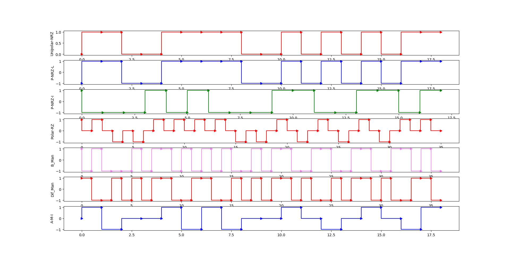

# Line-Encoding
Various Line Encoding techniques Implementations. Line Encoding is the method by which analog/digital data is converted into analog/digital electromagnetic signals for transmission via. wired/wireless transmission links. Computer Communication uses both analog and digital signal transmissions, depending on the underlying media.

Input : Data Bit size = 24     Data = 101010101010101010101010

